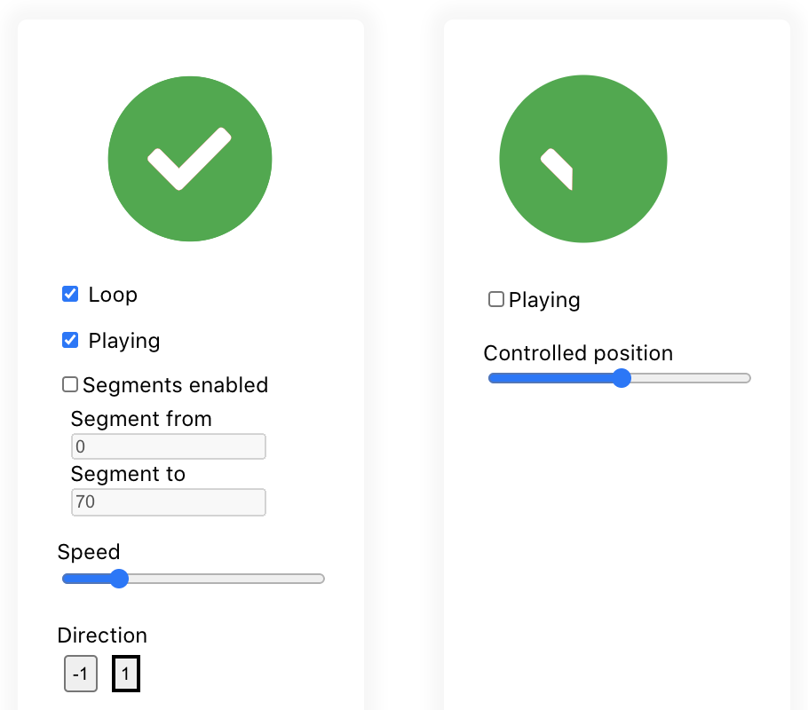

Fully declarative React Lottie player

Inspired by [several](https://github.com/felippenardi/lottie-react-web) [existing](https://github.com/chenqingspring/react-lottie) [packages](https://github.com/Gamote/lottie-react) wrapping [lottie-web](https://github.com/airbnb/lottie-web) for React, I created this package because I wanted something that just works and is easy to use. None of the alternatives properly handle changes of props like playing/pausing/segments. This lead to lots of hacks to get the animations to play correctly.

`react-lottie-player` is a complete rewrite using hooks 🎣 for more readable code, easy to use, seamless and fully declarative control of the lottie player.

 [](https://www.npmjs.com/package/react-lottie-player) [](https://standardjs.com)

## Features

- Fully declarative
- Handles state changes correctly
- Does not [leak memory like lottie-web](https://github.com/mifi/react-lottie-player/issues/35) if you use repeaters
- [LottiePlayerLight](#lottieplayerlight) support (no `eval`)
- Alternative imperative API using ref (use at your own risk)

## Install

```bash
npm install --save react-lottie-player
```

## Usage

```jsx
import React from 'react'

import Lottie from 'react-lottie-player'
// Alternatively:
// import Lottie from 'react-lottie-player/dist/LottiePlayerLight'

import lottieJson from './my-lottie.json'

export default function Example() {
  return (
    <Lottie
      loop
      animationData={lottieJson}
      play
      style={{ width: 150, height: 150 }}
    />
  )
}
```

## Example

<a href="https://mifi.github.io/react-lottie-player/">
  
</a>

[🎛 Live demo](https://mifi.github.io/react-lottie-player/)

[👩🏿‍💻 Example code](example/src/App.jsx)

## Lazy loading

### Option 1: React code splitting (`React.lazy`)

Extract your Lottie animation into a separate component, then lazy load it:

```js
// MyLottieAnimation.jsx

import Lottie from 'react-lottie-player';
import animation from './animation.json';

export default function MyLottieAnimation(props) {
  return <Lottie animationData={animation} {...props} />;
}

// MyComponent.jsx

import React from 'react';
const MyLottieAnimation = React.lazy(() => import('./MyLottieAnimation'));

export default function MyComponent() {
  return <MyLottieAnimation play />;
}
```

### Option 2: dynamic import with state

```js
const Example = () => {
  const [animationData, setAnimationData] = useState<object>();

  useEffect(() => {
    import('./animation.json').then(setAnimationData);
  }, []);

  if (!animationData) return <div>Loading...</div>;
  return <Lottie animationData={animationData} />;
}
```

### Option 3: `path` URL

```js
const Example = () => <Lottie path="https://example.com/lottie.json" />;
```

## Imperative API (ref)

```js
const lottieRef = useRef();

useEffect(() => {
  console.log(lottieRef.current.currentFrame);
}, [])

return <Lottie ref={lottieRef} />;
```

See also [#11](https://github.com/mifi/react-lottie-player/issues/11)

## LottiePlayerLight

The default lottie player uses `eval`. If you don't want eval to be used in your code base, you can instead import `react-lottie-player/dist/LottiePlayerLight`. For more discussion see [#39](https://github.com/mifi/react-lottie-player/pull/39).

## Lottie animation track scrolling div

See [example/App.jsx](example/src/App.jsx) (ScrollTest) in [live example](https://mifi.github.io/react-lottie-player/).

## Resize mode: cover

If you want the animation to fill the whole container, you can pass this prop. See also [#55](https://github.com/mifi/react-lottie-player/issues/55):

```js
<Lottie rendererSettings={{ preserveAspectRatio: 'xMidYMid slice' }} />
```

## API

See [type definitions](src/index.d.ts) and [lottie-web](https://github.com/airbnb/lottie-web).

## Releasing

- Commit & wait for CI tests
- `np`

## Credits

- https://lottiefiles.com/26514-check-success-animation
- https://lottiefiles.com/38726-stagger-rainbow
- Published with [create-react-library](https://github.com/transitive-bullshit/create-react-library) 😎

## License

MIT © [mifi](https://github.com/mifi)

---

Made with ❤️ in [🇳🇴](https://www.youtube.com/watch?v=uQIv8Vo9_Jc)

[More apps by mifi.no](https://mifi.no/)

Follow me on [GitHub](https://github.com/mifi/), [YouTube](https://www.youtube.com/channel/UC6XlvVH63g0H54HSJubURQA), [IG](https://www.instagram.com/mifi.no/), [Twitter](https://twitter.com/mifi_no) for more awesome content!
